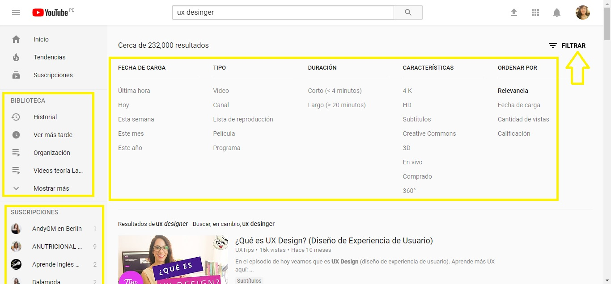
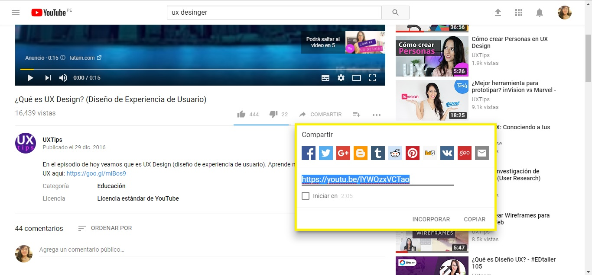
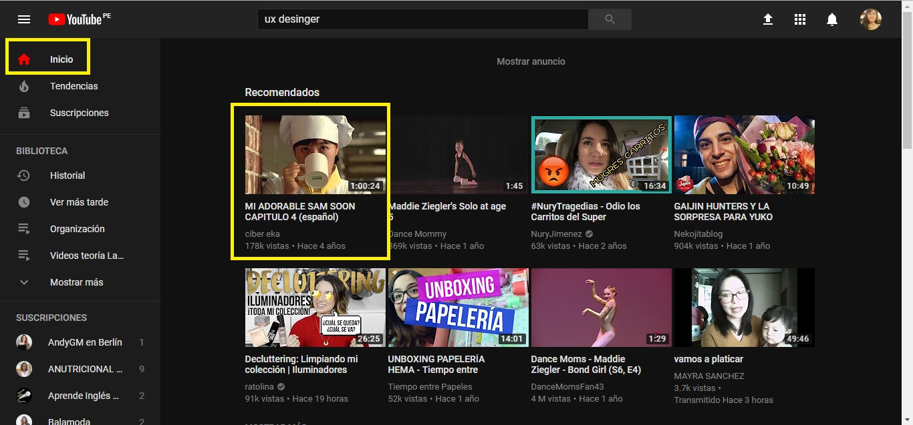

Reto - UX / UI
============

Objetivo
--------
Este reto consiste en elegir una web de preferencia y explicar qué partes conforman el UX y qué partes el UI.

Desarrollo
----------

### *1. UX* ###
* Poner pausa y seguir en cualquier dispositivo.
* Que el usuario pueda suscribirse a todos sus canales favoritos.
* Que el usuario pueda guardar videos en sus propias carpetas (biblioteca).
* Que sugiera videos basados en el historial y/o las suscripciones.
* Que la calidad del video cambie automáticamente dependiendo de la velocidad de conexión.
* Que los videos se pueden compartir en cualquier red social.
* Que te de la opción de filtrar según lo requerido por el usuario.

### *1. UI* ###
* Diseño de los botones.
* El color del fondo se oscurece en las zonas claras de la página (cambia de plomo a negro)
* Diseño de los menús
* Cambio de color del ícono al escoger una opción en el menú.
* Barra de play con botones para subtítulos, volumen, configuración, tamaño pantalla, etc.
* El tamaño de la vista de los videos.
* La barra de avance en el consumo del contenido de un video.
* La campana de notificación cambia de color y mantine una numeración según la cantidad de notificaciones.

